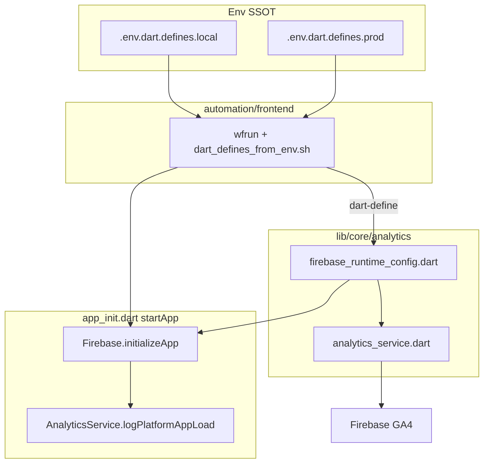

# Firebase Analytics — arcori (flutter_base_06)

Reference for Firebase **Google Analytics (GA4)** in the Arcori Flutter app.

**Scope:** Firebase is used **only for GA4** on native Android/iOS. There is no Firebase Auth, Cloud Messaging, Firestore, Remote Config, Crashlytics, or Performance Monitoring. The Python/Dart backends do **not** use Firebase.

**Current events:** platform bootstrap (`app_load_android` / `app_load_ios`) plus auth funnel events in `auth_analytics.dart`.

**Related:** [wfsecrets.md](../00_System_Wide/wfsecrets.md) (env files), [NAVIGATION_SYSTEM.md](Flutter/NAVIGATION_SYSTEM.md)

---

## 1. Architecture



| Component | Path | Role |
|-----------|------|------|
| Runtime switch | `lib/core/analytics/firebase_runtime_config.dart` | `FIREBASE_SWITCH`, environment, platform |
| GA4 wrapper | `lib/core/analytics/analytics_service.dart` | `logEvent`, `logPlatformAppLoad` |
| Platform options | `lib/firebase_options.dart` | All keys from `--dart-define` |
| Bootstrap | `lib/app_init.dart` | Init + bootstrap events |

---

## 2. Flutter packages

From `app_codebase/flutter_base_06/pubspec.yaml`:

```yaml
firebase_core: 3.3.0
firebase_analytics: 11.0.0
```

Pinned for Xcode 15.2 / Firebase iOS SDK 10.x compatibility. Upgrade only after verifying iOS CI Xcode version.

---

## 3. Configuration (SSOT)

### 3.1 Dart-define env files (repo root)

| File | Use |
|------|-----|
| `.env.dart.defines.local` | Dev: `wfrun` → `automation/frontend/launch_*.sh` (local) |
| `.env.dart.defines.prod` | Release: `build_appbundle.sh`, iOS CI |

Copy from `.env.dart.defines.*.sample`. Launch scripts pass every key as `--dart-define=KEY=value` via `automation/frontend/dart_defines_from_env.sh`.

**Master switch:**

| Key | Sample default (local) | Role |
|-----|------------------------|------|
| `FIREBASE_SWITCH` | `false` | On/off for init and all analytics |
| `FIREBASE_APP_ENVIRONMENT` | `development` / `production` | Sent as `app_environment` on every event |

**Android keys:** `FIREBASE_ANDROID_API_KEY`, `FIREBASE_ANDROID_APP_ID`, `FIREBASE_ANDROID_MESSAGING_SENDER_ID`, `FIREBASE_ANDROID_PROJECT_ID`, `FIREBASE_ANDROID_STORAGE_BUCKET`

**iOS keys:** `FIREBASE_IOS_API_KEY`, `FIREBASE_IOS_APP_ID`, `FIREBASE_IOS_MESSAGING_SENDER_ID`, `FIREBASE_IOS_PROJECT_ID`, `FIREBASE_IOS_STORAGE_BUCKET`, `FIREBASE_IOS_BUNDLE_ID`

**Web:** `launch_chrome.sh` forces `FIREBASE_SWITCH=false` regardless of env file.

### 3.2 Native config files (gitignored)

Required for Android/iOS **builds** (Gradle / Xcode). Copy from samples after FlutterFire setup:

| Sample | Real file (gitignored) |
|--------|------------------------|
| `android/app/google-services.json.sample` | `android/app/google-services.json` |
| `ios/Runner/GoogleService-Info.plist.sample` | `ios/Runner/GoogleService-Info.plist` |

When changing Firebase project: update **both** dart-defines **and** native JSON/plist from Firebase Console (or re-run `flutterfire configure`).

FlutterFire registry: `app_codebase/flutter_base_06/firebase.json`.

---

## 4. Initialization

Order in `startApp()` (`lib/app_init.dart`):

1. `WidgetsFlutterBinding.ensureInitialized()`
2. `_initializeFirebaseIfEnabled()` — gated by `FIREBASE_SWITCH` and configured dart-defines
3. Module registry + `runApp()`

Firebase init:

```dart
if (FirebaseRuntimeConfig.isEnabled &&
    DefaultFirebaseOptions.isCurrentPlatformConfigured) {
  if (Firebase.apps.isEmpty) {
    await Firebase.initializeApp(options: DefaultFirebaseOptions.currentPlatform);
  }
}
await AnalyticsService.instance.logPlatformAppLoad();
```

- **`duplicate-app`**: caught on Android when native auto-init from `google-services.json` already created the default app.
- If `FIREBASE_SWITCH=false` or dart-defines are empty, Firebase is skipped entirely.

---

## 5. AnalyticsService

**File:** `lib/core/analytics/analytics_service.dart`

| Method | Behaviour |
|--------|-----------|
| `logEvent(name, parameters?)` | Merges `app_environment`, `app_platform`; adds `debug_mode: 1` in non-production |
| `logPlatformAppLoad()` | Logs `app_load_android` or `app_load_ios` on cold start |
| `AuthAnalytics` (`modules/auth/auth_analytics.dart`) | Auth funnel events (bootstrap guest, login, convert) |

**Rules:**

- All calls no-op when `FIREBASE_SWITCH` is false.
- Errors are swallowed (never break UX).
- Do **not** use parameter names with a `firebase_` prefix — GA4 rejects reserved prefixes.

---

## 6. Event catalog

### 6.1 Automatic parameters (every `logEvent`)

| Parameter | Source |
|-----------|--------|
| `app_environment` | `FIREBASE_APP_ENVIRONMENT` |
| `app_platform` | `FirebaseRuntimeConfig.appPlatform` |
| `debug_mode` | `1` when not production (omitted in prod) |

### 6.2 Custom events

| Event | When |
|-------|------|
| `app_load_android` | Once per cold start on Android (after first frame) |
| `app_load_ios` | Once per cold start on iOS (after first frame) |
| `account_guest_bootstrap_created` | Auto guest account created on first bootstrap (no local profile) |
| `account_full_create_attempt` | Create account / Convert button submitted (`flow`: `guest_convert` or `register`) |
| `account_guest_convert_success` | Guest upgraded to full account in-place |
| `account_login_attempt` | Sign in button submitted with valid form |
| `account_login_success` | Email/password sign-in succeeded |

Firebase also logs automatic GA4 events (`session_start`, `first_open`, `screen_view`, etc.) — those are SDK defaults, not defined in this template.

---

## 7. Platform setup

### 7.1 Android

**Gradle** (`android/settings.gradle.kts`, `android/app/build.gradle.kts`): `com.google.gms.google-services` plugin enabled.

**Application ID:** `com.reignofplay.arcori`

**Before first Android build:**

```bash
cp app_codebase/flutter_base_06/android/app/google-services.json.sample \
   app_codebase/flutter_base_06/android/app/google-services.json
# Replace with real file from Firebase Console when enabling analytics
```

### 7.2 iOS

**Podfile:** `platform :ios, '13.0'`

**Before first iOS build:**

```bash
cp app_codebase/flutter_base_06/ios/Runner/GoogleService-Info.plist.sample \
   app_codebase/flutter_base_06/ios/Runner/GoogleService-Info.plist
# Replace with real file from Firebase Console when enabling analytics
```

Then `cd app_codebase/flutter_base_06/ios && pod install`.

---

## 8. Launch scripts

| Script | Firebase behaviour |
|--------|-------------------|
| `automation/frontend/launch_android.sh` | Full dart-defines from `.env.dart.defines.local` |
| `automation/frontend/launch_ios.sh` | Full dart-defines from `.env.dart.defines.local` |
| `automation/frontend/launch_chrome.sh` | Forces `FIREBASE_SWITCH=false` |
| `automation/frontend/build_appbundle.sh` | Production `.env.dart.defines.prod`; use `FIREBASE_APP_ENVIRONMENT=production` |

---

## 9. DebugView (development)

1. **Event parameter:** `debug_mode: 1` when `FIREBASE_APP_ENVIRONMENT` ≠ `production`.
2. **Android device property** (required for DebugView on Android; `launch_android.sh` sets this when `FIREBASE_SWITCH=true`):

```bash
adb shell setprop debug.firebase.analytics.app com.reignofplay.arcori
```

Clear when done: `adb shell setprop debug.firebase.analytics.app .none.`

View events: Firebase Console → Analytics → **DebugView**.

---

## 10. First-time setup checklist

1. Create Firebase project; register Android (`com.reignofplay.arcori`) and iOS apps.
2. From `app_codebase/flutter_base_06`: `flutterfire configure` (updates `firebase.json`; keep `firebase_options.dart` dart-define driven).
3. Copy native configs from Console (or samples) into gitignored paths above.
4. Fill `FIREBASE_*` keys in `.env.dart.defines.local`.
5. Set `FIREBASE_SWITCH=true` when ready to test.
6. `wfrun` → `launch_android.sh` or `launch_ios.sh`; cold-start app; check DebugView for `app_load_android` or `app_load_ios`.

---

## 11. Troubleshooting

| Symptom | Likely cause | Action |
|---------|--------------|--------|
| No Firebase events | `FIREBASE_SWITCH=false` or empty dart-defines | Check `.env.dart.defines.local`; verify `DefaultFirebaseOptions.isCurrentPlatformConfigured` |
| Android build fails | Missing `google-services.json` | Copy from sample or download from Console |
| iOS build fails | Missing `GoogleService-Info.plist` | Copy from sample or download from Console |
| Events in DebugView only | Non-production `FIREBASE_APP_ENVIRONMENT` | Expected for dev |
| `duplicate-app` on Android | Native + Dart both init | Handled in `app_init.dart`; harmless |
| Web shows no analytics | By design | Chrome forces `FIREBASE_SWITCH=false` |

---

## 12. Future extensions

When adding more events: create `lib/modules/<name>/<name>_analytics.dart` helpers that call `AnalyticsService.instance.logEvent`. Keep `module_registry.dart` wiring-only.

**Out of scope today:** screen views, auth `setUserId`, backend analytics HTTP, AdMob GA4 events, web Firebase.

---

## 13. File index

| Path | Role |
|------|------|
| `lib/app_init.dart` | Firebase init + platform bootstrap event |
| `lib/firebase_options.dart` | Platform options from dart-define |
| `lib/core/analytics/firebase_runtime_config.dart` | `FIREBASE_SWITCH`, environment |
| `lib/core/analytics/analytics_service.dart` | GA4 wrapper |
| `firebase.json` | FlutterFire CLI registry |
| `android/app/google-services.json.sample` | Android native config sample |
| `ios/Runner/GoogleService-Info.plist.sample` | iOS native config sample |
| `.env.dart.defines.local.sample` | Local dart-define template |
| `.env.dart.defines.prod.sample` | Prod dart-define template |
| `automation/frontend/dart_defines_from_env.sh` | Env → `--dart-define` args |
