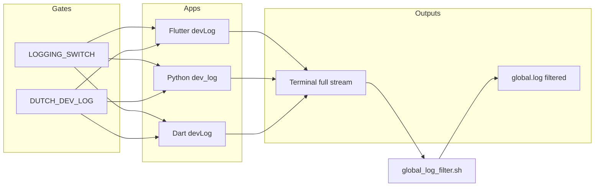

# Dutch app dev — logging, mirroring, and launch scripts

This document describes how **developer-facing logs** work across **Flutter**, **Python (FastAPI)**, and **Dart (WebSocket server)**, how they can be **mirrored into a single repo file** (`global.log`), how that relates to **shell launchers** and **VS Code**, and how **switches** interact with **production builds**.

For day-to-day agent guidance on where to look when debugging locally, see [`.cursor/rules/logging-rule.mdc`](../../.cursor/rules/logging-rule.mdc).

---

## 1. Concepts at a glance

| Concept | Role |
|--------|------|
| **`customlog`** | Small, intentional **dev-only** messages with a stable **`[dev]`** prefix so scripts can filter them (Flutter, Dart WS, Python). |
| **`DUTCH_DEV_LOG`** | **Environment / compile-time gate**: when truthy, `customlog` actually prints; otherwise it is a no-op. |
| **`LOGGING_SWITCH`** | **Per-entrypoint compile-time (or file-level) toggle** around *whether to call* `customlog` at all. Independent of `DUTCH_DEV_LOG`. |
| **`global.log`** | **Optional merged file** at the **repo root** (`app_dev/global.log`). Only **filtered** dev lines are appended; full process output stays on the **terminal**. |
| **`run_*_to_global_log.sh`** | Wrappers that run a stack process and **tee-filter** stdout/stderr into `global.log` while printing everything to the terminal. |
| **`launch_chrome.sh`** | **`wfrun`** Flutter Chrome launcher; pipes output through **`global_log_filter.sh`** into `global.log`. |

There is **no separate `mlog` binary** in this repository. If you use “merged log” or “mirrored log” as a mental model, that file is **`global.log`**. Tail it from the repo root, for example:

```bash
tail -f /path/to/app_dev/global.log
```

---

## 2. The `[dev]` line format (contract for filtering)

All three stacks use the same **visible prefix** so shell filters stay simple:

- **Python:** `print(f"[dev] {message}", file=sys.stderr, …)` in `dev_log`.
- **Dart WS:** `stderr.writeln('[dev] $message')`.
- **Flutter:** `debugPrint('[dev] $message')` on VM; on Web, same via `debugPrint`.

**Filtering rule (Python / Dart wrappers):** only lines whose **full line** matches **`^\[dev\]`** (after any tooling prefix on the same line — see Flutter below) are copied to `global.log` by the Python and Dart scripts.

**Flutter nuance:** `flutter run` and **Android logcat** typically prefix lines with something like `I/flutter (12345): …`. The Flutter wrapper therefore appends to `global.log` when the line **contains** `I/flutter` or `I flutter` **and** contains the substring **`[dev]`**. Consecutive **identical** matching lines are **deduplicated** to reduce duplicate taps from tooling.

---

## 3. Gate: `DUTCH_DEV_LOG`

### 3.1 Truthy values

Across stacks, “on” is consistently:

- `1`, `true`, or `yes` (case-insensitive where applicable).

### 3.2 Flutter / Dart compile-time vs runtime

| Surface | How `DUTCH_DEV_LOG` is read |
|--------|----------------------------|
| **Flutter VM** (`dev_logger_io.dart`) | `String.fromEnvironment('DUTCH_DEV_LOG')` **first**; if empty, **`Platform.environment['DUTCH_DEV_LOG']`** (useful for desktop). |
| **Flutter Web** (`dev_logger_web.dart`) | `String.fromEnvironment('DUTCH_DEV_LOG')` **first**; if not set, falls back to **`kDebugMode`**. |
| **Dart WS** (`dart_bkend_base_02/bin/utils/dev_logger.dart`) | **`Platform.environment['DUTCH_DEV_LOG']` only** (set via `.env.local` / Docker `env_file`). |

Launch scripts that care about Flutter pass `DUTCH_DEV_LOG` via **`.env.dart.defines.local`** → `--dart-define=DUTCH_DEV_LOG=1` ([`dart_defines_from_env.sh`](../../automation/frontend/dart_defines_from_env.sh)).

### 3.3 Python

`python_base_05/bin/core/utils/dev_logger.py` reads **`os.environ["DUTCH_DEV_LOG"]`** with the same truthy set as above. Backends load `.env.local` via Docker Compose (`docker-compose.debug.yml` `env_file`).

---

## 4. API entry points (where to call from code)

| Stack | Import / module | Function | Output stream |
|-------|-----------------|----------|----------------|
| Flutter | `flutter_base_06/lib/utils/dev_logger.dart` | `customlog(String)` | `debugPrint` → device / `flutter run` |
| Dart WS | `dart_bkend_base_02/bin/utils/dev_logger.dart` | `customlog(String)` | `stderr` |
| Python | `python_base_05/bin/core/utils/dev_logger.py` | `customlog(str)` | `stderr` |

**Do not** reintroduce a legacy singleton `Logger` in Flutter. Use **`customlog`** only, gated by **`if (LOGGING_SWITCH)`** per file.

---

## 5. `LOGGING_SWITCH` (one switch per file — strict)

**Policy:** the **only** gate for calling `customlog` is **`LOGGING_SWITCH`**. No `devLogSwitch`, no `LOGGING_SWITCH || other`, no env/define wiring on `LOGGING_SWITCH` itself. See `.cursor/rules/logging-rule.mdc`.

`LOGGING_SWITCH` is separate from **`DUTCH_DEV_LOG`** (checked inside `customlog`):

- **`LOGGING_SWITCH` false** → do not call `customlog` in that block.
- **`LOGGING_SWITCH` true** but **`DUTCH_DEV_LOG` off** → call runs; `customlog` no-ops.

**Dart — define once per file:**

```dart
const bool LOGGING_SWITCH = false;
```

**Python:** `LOGGING_SWITCH = False` at module level (only name allowed).

Set **`LOGGING_SWITCH` to `true` / `True`** while actively tracing in a file; flip back to **`false` / `False`** when done. **`LOGGING_SWITCH` is always a plain boolean** — never derived from `DUTCH_DEV_LOG` or environment.

**Release / Docker tooling** may set **`LOGGING_SWITCH`** to **`false`** in bulk. That is independent of **`DUTCH_DEV_LOG`** on release builds.

---

## 6. `global.log` mirroring (merged dev log)

### 6.1 Location

- **Path:** `<repo_root>/global.log`
- **Git:** typically untracked or local-only; safe to delete; it is recreated on append.

### 6.2 What gets written

| Writer script | Process | Terminal | Appended to `global.log` |
|---------------|---------|----------|---------------------------|
| `automation/backend/docker_logs_to_global_log.sh` | `docker compose logs -f Arcori_api Arcori_dart` | Full stream | Lines containing **`[dev]`** |
| `automation/frontend/launch_chrome.sh` | `flutter run -d chrome` (via `wfrun`) | Full stdout/stderr | Lines matching **`I/flutter` or `I flutter`** and containing **`[dev]`**; consecutive duplicates skipped |

**Auto-spawn from stack up:** `docker_up.sh` / `docker_up_build.sh` spawn the Docker mirror when **`WFRUN_MIRROR_GLOBAL_LOG`** is truthy (`1` / `true` / `yes` / `on`). On the dashboard, the **Mirror [dev] → global.log** checkbox (those two scripts only) sets that env for the run. Spawn is skipped if a mirror is already running; detached process output lands in `.dashboard_logs/docker_logs_mirror.log`.

Implementation uses bash read loops in [`global_log_filter.sh`](../../automation/frontend/global_log_filter.sh):

- Every line is printed to the terminal.
- Matching lines are **`fflush`**’d to `global.log` promptly.
- **`PIPESTATUS[0]`** preserves the **real** exit code of `python` / `dart` / `flutter` (first pipeline stage).

**Banners** (script start markers) go to **stderr only** — they do **not** pollute `global.log`.

### 6.3 What does *not* go to `global.log`

- Normal FastAPI access logs, tracebacks, stdlib `logging`, etc. — unless formatted with **`[dev]`** (not standard).
- Flutter engine noise, SVG warnings, VM service URLs — **unless** they contain **`[dev]`** in the same line as the Flutter log prefix (they usually do not).

### 6.4 Multiple processes

If you run **Python**, **Dart**, and **Flutter** at the same time, all may append to the **same** `global.log`. Lines are **interleaved** by time. There is no built-in per-process header on each line; use context (`[dev]` message text) or run one stack at a time if you need isolation.

---

## 7. Launch scripts

| Script | Purpose |
|--------|---------|
| [`automation/frontend/launch_chrome.sh`](../../automation/frontend/launch_chrome.sh) | Chrome `flutter run` via **`wfrun`**; mirrors `[dev]` Flutter lines to `global.log`. |
| [`automation/frontend/run_chrome_to_global_log.sh`](../../automation/frontend/run_chrome_to_global_log.sh) | Loads `.env.local` + `.env.dart.defines.local` for **VS Code / Cursor** (`launch.json`). |
| [`automation/backend/docker_logs_to_global_log.sh`](../../automation/backend/docker_logs_to_global_log.sh) | Tails Docker backend logs; mirrors `[dev]` lines to `global.log`. |

**Backends** (FastAPI + Dart WS) run via **`docker compose`** only — see [`wfrun.md`](../00_System_Wide/wfrun.md). Set `DUTCH_DEV_LOG=1` in `.env.local` for dev containers.

---

## 8. VS Code / Cursor (`launch.json`)

[`.vscode/launch.json`](../../.vscode/launch.json) runs:

- `automation/frontend/run_chrome_to_global_log.sh` — Flutter Chrome with `global.log` mirroring.

---

## 9. Production and CI vs dev logging

| Mechanism | Dev | Production / release builds |
|-----------|-----|-------------------------------|
| `DUTCH_DEV_LOG` | Set by scripts / env | Usually **unset** or `0` |
| `devLog` / `dev_log` | Emits `[dev] …` | No-op when gate off |
| `LOGGING_SWITCH` | Often `true` in debug entrypoints | Build scripts may force **`false`** across many files |
| `global.log` | Optional local merge | Not used on servers by default |

Python **`custom_log`** (and similar) is the broader application logging path and is **not** the same subsystem as **`dev_log`**; it is governed by module-level switches and server configuration, not by `DUTCH_DEV_LOG`.

---

## 10. Troubleshooting

| Symptom | Things to check |
|---------|------------------|
| Nothing in `global.log` from Flutter | `DUTCH_DEV_LOG` in `.env.dart.defines.local`, `LOGGING_SWITCH` true in target file, launch via **`launch_chrome.sh`** or **`run_chrome_to_global_log.sh`**. |
| Nothing from Python/Dart | `DUTCH_DEV_LOG=1` in `.env.local`; Docker containers restarted; `LOGGING_SWITCH` true; lines must include **`[dev]`** on stderr. |
| `global.log` empty but terminal shows `[dev]` | Flutter: confirm `launch_chrome.sh` filter is active. Backends: use **`docker_logs_to_global_log.sh`**, or run **`docker_up.sh` / `docker_up_build.sh`** with **`WFRUN_MIRROR_GLOBAL_LOG=1`** / dashboard checkbox. |
| Flutter Web: no `devLog` | Without `--dart-define`, Web falls back to **`kDebugMode`** only — use launch scripts or add the define. |
| Duplicate lines in `global.log` | Multiple terminals writing the same stack; or old content — truncate `global.log` before a session. Flutter script already dedupes **consecutive** identical lines. |

---

## 11. File index (quick navigation)

| Path | Notes |
|------|------|
| `flutter_base_06/lib/utils/dev_logger.dart` | Conditional export to IO vs Web impl. |
| `flutter_base_06/lib/utils/dev_logger_io.dart` | VM: define + `Platform.environment`. |
| `flutter_base_06/lib/utils/dev_logger_web.dart` | Web: define + `kDebugMode`. |
| `dart_bkend_base_02/bin/utils/dev_logger.dart` | Env-only gate. |
| `python_base_05/bin/core/utils/dev_logger.py` | Env gate, stderr `[dev]`. |
| `automation/frontend/global_log_filter.sh` | Shared Flutter / backend filter helpers. |
| `automation/frontend/launch_chrome.sh` | Chrome `flutter run` + `global.log` mirroring. |
| `automation/frontend/run_chrome_to_global_log.sh` | IDE launcher (loads env, calls `launch_chrome.sh`). |
| `automation/backend/docker_logs_to_global_log.sh` | Docker backend → `[dev]` → `global.log`. |
| `.vscode/launch.json` | Uses `run_chrome_to_global_log.sh`. |
| `.cursor/rules/logging-rule.mdc` | Agent policy for `LOGGING_SWITCH` / `customlog`. |

---

## 12. Optional diagram (data flow)



This ends the logging system reference for the arcori workspace.
