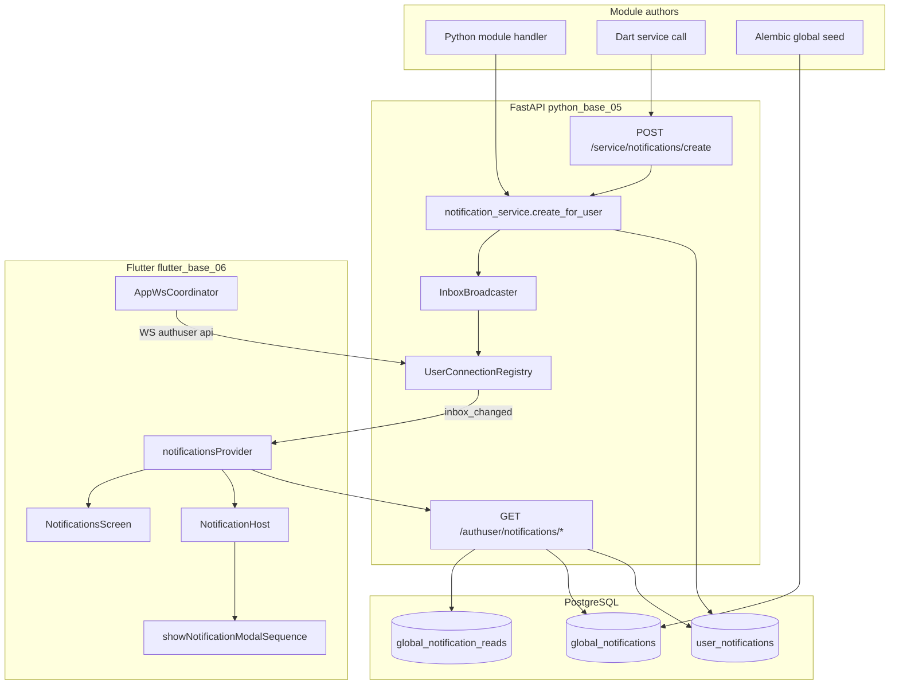

# arcori — Notification system

Technical guide for the in-app notification system across **FastAPI** (persistence + WS push) and **Flutter** (inbox, modals, read state).

**Chart + plain English guide:** [notification-system-flow — diagram](../02_FlowCharts/charts/base/notification-system-flow.html) · [guide](../02_FlowCharts/charts/base/notification-system-flow.guide.html)

Regenerate charts: `python3 automation/backend/build_nav_and_charts.py` or `wfcharts` from project root.

Related: [WS_SYSTEM.md](WS_SYSTEM.md) (WebSocket transport), [ERROR_SYSTEM.md](ERROR_SYSTEM.md) (envelopes), [Flutter/MODAL_SYSTEM.md](Flutter/MODAL_SYSTEM.md) (notification modals), [Flutter/THEME_SYSTEM.md](Flutter/THEME_SYSTEM.md) (modal styling).

---

## Overview

Notifications are **in-app only** (PostgreSQL inbox + modals). There is no FCM/APNs OS push in this template.

Two scopes:

| Scope | Table | Who gets the row | Read tracking |
|-------|-------|------------------|---------------|
| **User** | `user_notifications` | One row per user | `read_at` on the row |
| **Global** | `global_notifications` | One campaign row; all eligible users | `global_notification_reads` per user |

Two display types (`type` = **delivery channel**):

| `type` | Auto modal (unread) | Inbox list |
|--------|---------------------|------------|
| `instant` | Yes | Yes |
| `inbox` | No | Yes |

**Semantic identity:** `category` (parent) + `subtype` (child), registered per module in the subtype registry. Required on create and global sync. `type` stays delivery only — do not overload it for meaning.

**“Push” while the app is open:** insert in Postgres → `InboxBroadcaster.notify_inbox_changed(user_id)` → FastAPI WS event → Flutter refetch → modal for unread `instant`.

**Offline / killed app:** rows wait in Postgres; client fetches on login, WS connect, app resume, or opening the notifications screen.

---

## Architecture



---

## Database schema

Migration: `005_notifications.py`, `007_notification_category.py` (adds `category`).

### `user_notifications`

| Column | Notes |
|--------|-------|
| `id` | UUID PK |
| `user_id` | FK → `users.id` |
| `source` | Module name (e.g. `example_module`) — used for reply handler dispatch |
| `type` | Delivery channel: `instant` \| `inbox` |
| `category` | Semantic parent type (e.g. `demo`, `system`, `record`) — required on create |
| `subtype` | Semantic child variant (e.g. `welcome`, `example_navigate_demo`) — required on create |
| `msg_id` | Optional logical id for response dispatch |
| `title`, `body` | Required copy |
| `data` | JSONB — opaque module payload (deeplinks, context ids, etc.) |
| `responses` | JSONB array — button definitions (see [Responses](#responses-and-acknowledge-logic)) |
| `read_at` | null = unread |
| `deleted_at` | Soft delete |
| `created_at` | timestamptz |

### `global_notifications`

Same content fields as user rows, plus:

| Column | Notes |
|--------|-------|
| `target_audience` | JSONB, default `{"all": true}` |
| `is_active` | bool |
| `starts_at`, `ends_at` | Optional scheduling window |

Seeded welcome campaign: `category = system`, `subtype = welcome`, `msg_id = global_welcome_v1`, `type = instant`.

### `global_notification_reads`

| Column | Notes |
|--------|-------|
| `user_id`, `global_notification_id` | Unique pair |
| `read_at` | timestamptz |

---

## Real-time delivery (WebSocket)

### Post-auth connection (Flutter)

After auth bootstrap, `AppWsCoordinator` connects connection id **`api`** to `ARCORI_API_WS_URL` (`/ws/authuser`).

| File | Role |
|------|------|
| `lib/core/ws/app_ws_coordinator.dart` | Auto-connect when authenticated |
| `lib/core/ws/app_lifecycle_observer.dart` | On `AppLifecycleState.resumed` → reconnect + resume hooks |
| `lib/core/ws/app_ws_constants.dart` | `kAppApiWsConnectionId = 'api'` |

Reconnect scenarios:

| Scenario | Behaviour |
|----------|-----------|
| Login / token refresh | `WsConnectionManager` auth listener → `reconnectAll()` |
| Socket drop (foreground) | Exponential backoff reconnect |
| App backgrounded | OS may kill socket |
| App resumed / cold start | Lifecycle observer + auth bootstrap → connect + inbox refresh |
| Logout | `disconnectAll()` |

### User-indexed fan-out (Python)

| File | Role |
|------|------|
| `bin/core/state/user_connection_registry.py` | Maps `user_id` → WS `connection_id`s |
| `bin/core/ws/inbox_broadcaster.py` | `notify_inbox_changed(user_id)` |
| `bin/core/ws/ws_dispatcher.py` | Registers user on authuser auth; unregisters on close |

WS frame sent to online sessions:

```json
{
  "ok": true,
  "data": {
    "type": "event",
    "channel": "notifications/inbox",
    "payload": { "event": "inbox_changed" }
  }
}
```

Flutter handler (`register_notifications_state.dart`) refetches inbox + globals on this event.

**Multi-worker note:** fan-out is in-memory per Gunicorn worker. **Online status** is cross-worker via Redis presence — see [PRESENCE_SYSTEM.md](PRESENCE_SYSTEM.md). WS `inbox_changed` delivery across workers still requires Redis pub/sub (deferred).

---

## HTTP API

All responses use `{ "ok": true, "data": … }` or `{ "ok": false, "error": { "code", "message" } }`.

### Service tier — create user notification

```http
POST /service/notifications/create
X-Service-Key: <SERVICE_KEY>
Content-Type: application/json
```

**Body (required fields in bold):**

```json
{
  "user_id": "550e8400-e29b-41d4-a716-446655440000",
  "source": "my_module",
  "type": "instant",
  "category": "game",
  "title": "Match ready",
  "body": "Your bracket is live.",
  "subtype": "bracket_ready",
  "msg_id": "my_module_bracket_v1",
  "data": { "bracket_id": "b42" },
  "responses": [
    { "label": "View", "action_identifier": "view" },
    { "label": "Dismiss", "action_identifier": "dismiss" }
  ]
}
```

**Response:**

```json
{
  "ok": true,
  "data": { "message_id": "7c9e6679-7425-40de-944b-e07fc1f90ae7" }
}
```

After insert, connected clients receive `inbox_changed` on WS.

### Authuser tier — read / mutate

| Method | Path | Body / query |
|--------|------|----------------|
| GET | `/authuser/notifications/messages` | `limit`, `offset`, `unread_only` |
| GET | `/authuser/notifications/globals` | — |
| POST | `/authuser/notifications/mark-read` | `{ "message_ids": ["uuid", …] }` (max 100) |
| POST | `/authuser/notifications/global-mark-read` | `{ "global_message_ids": ["glob_…", …] }` (max 50) |
| POST | `/authuser/notifications/delete` | `{ "message_ids": ["uuid", …] }` — soft delete |

**List response shape:**

```json
{
  "ok": true,
  "data": {
    "messages": [
      {
        "id": "7c9e6679-7425-40de-944b-e07fc1f90ae7",
        "origin": "user",
        "source": "my_module",
        "type": "instant",
        "category": "game",
        "subtype": "bracket_ready",
        "msg_id": "my_module_bracket_v1",
        "title": "Match ready",
        "body": "Your bracket is live.",
        "data": { "bracket_id": "b42" },
        "responses": [
          { "label": "View", "action_identifier": "view" },
          { "label": "Dismiss", "action_identifier": "dismiss" }
        ],
        "read_at": null,
        "created_at": "2026-06-30T12:00:00+00:00"
      }
    ],
    "unread_count": 1
  }
}
```

**Global message ids:** client `id` = `glob_` + UUID hex without dashes (e.g. `glob_65f0a1b2c3d4e5f607182902001`). Field `global_id` carries the canonical UUID string.

---

## Wire message fields

| Field | User | Global |
|-------|------|--------|
| `id` | UUID string | `glob_<hex>` |
| `origin` | `"user"` | `"global"` |
| `type` | Delivery: `instant` \| `inbox` | same |
| `category` | Semantic parent (required on create) | same |
| `subtype` | Semantic child (required on create) | same |
| `source` | module name | e.g. `global_broadcast` |
| `msg_id` | optional logical id | optional logical id |
| `data` | JSON object | JSON object |
| `responses` | button defs | button defs |
| `read_at` | ISO timestamp or null | set when `user_read` |
| `user_read` | — | bool |

---

## Responses and acknowledge logic

### Declarative config (`data.response`) — preferred

Store interactive behaviour under `data.response`. When present it **wins** over legacy `responses[]`.

Two types:

| Type | Server | Client |
|------|--------|--------|
| `navigate` | Validated on create / sync | Resolve `screen` → path (or use `to_path`), `Nav.push`, optional mark-read |
| `reply` | `POST /authuser/notifications/response` → module handler | Render option buttons, POST, mark-read on success |

#### `navigate`

```json
{
  "data": {
    "response": {
      "type": "navigate",
      "buttons": [
        { "label": "Go to example", "screen": "example_module" },
        { "label": "View inbox", "screen": "notifications" },
        { "label": "Custom", "to_path": "/account?tab=sign-in" }
      ],
      "mark_read_on_action": true
    }
  }
}
```

- Each button requires `label` and exactly one of `screen` (logical name) or `to_path` (raw go_router path).
- Max 3 buttons.
- `screen` must be registered in `screen_names.py` **and** allowed by the subtype spec `allowed_screens` when defined.
- No server round-trip; tap navigates then marks read when `mark_read_on_action` is true (default).

Flutter maps `screen` via [NotificationScreenSink](../../app_codebase/flutter_base_06/lib/core/notifications/contracts/register_notification_screen_contract.dart) — each module registers slugs beside its routes in `register<Module>Routes(routes, notificationScreens)`. Runtime resolution: `resolveNotificationScreenPath(slug)`.

#### `reply`

```json
{
  "data": {
    "response": {
      "type": "reply",
      "options": [
        { "key": "accept", "label": "Accept" },
        { "key": "decline", "label": "Decline" }
      ],
      "mark_read_on_success": true
    }
  }
}
```

- `key` = stable snake_case id; `label` = button text. Max 5 options. Keys must match subtype spec `reply_option_keys` when defined.
- Tap → `POST /authuser/notifications/response` with `option_key`.
- Module handlers registered by `source` in `core/notifications/reply_registry.py`.

**Request body** (exactly one id):

```json
{ "message_id": "uuid", "option_key": "accept" }
{ "global_message_id": "glob_…", "option_key": "decline" }
```

**Response:** `{ "ok": true, "data": { "success": true, "data": { … } } }`

Error codes: `notifications/invalid_response_config`, `notifications/invalid_response`, `notifications/handler_not_found`, `notifications/not_reply_type`.

#### Module reply handler (Python)

```python
from core.errors.app_error import AppError
from core.notifications.reply_registry import register_reply_handler
from modules.notifications.notification_errors import HANDLER_NOT_FOUND, INVALID_RESPONSE

def _example_reply_handler(*, user_id, message, option_key, **_) -> dict:
    if message.get("subtype") != "example_reply_demo":
        raise AppError(HANDLER_NOT_FOUND)
    if option_key == "accept":
        return {"success": True, "data": {"status": "accepted"}}
    if option_key == "decline":
        return {"success": True, "data": {"status": "declined"}}
    raise AppError(INVALID_RESPONSE)

register_reply_handler("example_module", _example_reply_handler)
```

Wire from `register_notification_reply_handlers()` in `bin/modules/module_registry.py` — also resets and loads `register_builtin_notification_subtypes()`. Example: `bin/modules/example_module/example_notifications.py`.

Optional Flutter follow-up: `registerNotificationReplyListener(source, callback)` in `reply_listener_registry.dart`.

### Legacy `responses[]` (backward compatible)

Each entry:

```json
{ "label": "Got it", "action_identifier": "dismiss" }
```

When `data.response` is **absent**, `showNotificationModalSequence` uses **`responses[0].label`** as the single OK button (fallback `"OK"`). Dismiss → mark-read. Do not author new messages with `responses[]`; use `data.response`.

### Modal shell

| Layer | Behaviour |
|-------|-----------|
| **Modal session** | `showNotificationModalSequence` — one shell, cycles pending messages |
| **Inter-message delay** | 700ms default; per-subtype `inter_modal_delay_ms` |
| **Navigate** | 1–3 buttons from `data.response.buttons` (filtered by subtype `allowed_screens`) |
| **Reply** | Option buttons → API → mark-read on success |
| **Legacy** | Single OK; dismiss → `markRead()` |
| **User mark-read** | `POST /authuser/notifications/mark-read` |
| **Global mark-read** | `POST /authuser/notifications/global-mark-read` |


---

## Module integration — Python (in-process)

Preferred when the creating code runs inside the FastAPI process.

### Register a subtype (required before create)

**Python** — add to `register_builtin_subtypes.py` or a module registrar called from `register_notification_reply_handlers()`:

```python
from core.notifications.subtype_registry import register_notification_subtype
from core.notifications.subtype_spec import NotificationSubtypeSpec

register_notification_subtype(
    NotificationSubtypeSpec(
        source="my_module",
        category="game",
        subtype="bracket_ready",
        default_delivery="instant",
        allowed_screens=frozenset({"home", "notifications"}),
        allowed_response_types=frozenset({"navigate"}),
        modal_priority=80,
    )
)
```

**Flutter** — mirror in `registerBuiltinNotificationSubtypes()` or module `*_routes.dart` via `notificationSubtypeSink.registerSubtypes([...])`.

Create/sync rejects unknown `(source, category, subtype)` tuples with `notifications/unknown_subtype`.

### Minimal inbox notification

```python
from modules.notifications.notification_service import create_for_user
from models.user_notification import NOTIFICATION_TYPE_INBOX

message_id = create_for_user(
    user_id=str(user.id),
    source="my_module",
    notification_type=NOTIFICATION_TYPE_INBOX,
    title="Settings saved",
    body="Your preferences were updated.",
    category="settings",
    subtype="settings_saved",
)
```

### Instant notification with navigate buttons

```python
from modules.notifications.notification_service import create_for_user
from models.user_notification import NOTIFICATION_TYPE_INSTANT

create_for_user(
    user_id=str(user.id),
    source="tournaments",
    notification_type=NOTIFICATION_TYPE_INSTANT,
    title="Bracket ready",
    body="Your next match is scheduled.",
    category="game",
    subtype="bracket_ready",
    msg_id="tournament_bracket_v1",
    data={
        "bracket_id": "b42",
        "response": {
            "type": "navigate",
            "buttons": [
                {"label": "View bracket", "to_path": "/tournaments/bracket/b42"},
            ],
        },
    },
)
```

Online users get WS `inbox_changed` → modal with navigate button → tap pushes route and marks read.

### Real example in this repo (`example_module`)

After a durable record insert, `example_service.py` creates an **`inbox`** notification (no auto modal — list only):

```python
create_for_user(
    user_id,
    source="example_module",
    notification_type=NOTIFICATION_TYPE_INBOX,
    title="Example record saved",
    body=f"Revision {revision} was stored for your account.",
    category="record",
    subtype="example_record_saved",
    msg_id="example_module_record_saved",
    data={"record_id": str(row.id), "revision": revision},
)
```

Trigger: Dart `example/state` WS with `record: true` → `POST /service/example_module/record` → Python insert → notification create.

---

## Module integration — service tier (Dart / cross-process)

When the author runs outside FastAPI (e.g. Dart backend):

```http
POST /service/notifications/create
X-Service-Key: ${SERVICE_KEY}
Content-Type: application/json

{
  "user_id": "<uuid>",
  "source": "dart_game",
  "type": "instant",
  "category": "social",
  "title": "Room invite",
  "body": "You were invited to a room.",
  "subtype": "room_invite",
  "msg_id": "dart_room_invite_v1",
  "data": { "room_id": "demo" },
  "responses": [
    { "label": "Join", "action_identifier": "join" }
  ]
}
```

Same persistence and WS push as in-process create.

---

## Global notifications

Globals are **not** inserted into `user_notifications`. One row in `global_notifications`; per-user read in `global_notification_reads`.

- Seeded in migration `005_notifications` (welcome message).
- Listed via `GET /authuser/notifications/globals`.
- Unread `instant` globals are merged into the modal sequence alongside user instants (sorted by subtype `modal_priority`).
- Acknowledge via `global-mark-read` (same modal dismiss flow as user messages).

Example seed payload (`automation/backend/files/global_notifications.json`):

```json
{
  "type": "instant",
  "category": "system",
  "subtype": "welcome",
  "msg_id": "global_welcome_v1",
  "title": "Welcome to Arcori",
  "data": {
    "response": {
      "type": "navigate",
      "buttons": [
        { "label": "Explore", "screen": "example_module" },
        { "label": "Notifications", "screen": "notifications" }
      ]
    }
  }
}
```

Sync via `wfrun` → `automation/backend/sync_global_notifications.py` (see [Global campaign sync](#global-campaign-sync-no-api-restart)).

---

## Flutter implementation

### File layout

```
lib/modules/notifications/
├── notifications_api.dart          # REST client
├── notifications_state.dart        # NotificationMessage, types, throttle, sort
├── notifications_notifier.dart     # Riverpod state, fetch, mark-read, delete
├── register_notifications_state.dart  # WS + resume hooks
├── notification_modal.dart         # showNotificationModalSequence (700ms gap)
├── notification_host.dart          # Single call to modal sequence
├── notifications_screen.dart       # Inbox list
├── notifications_routes.dart
└── notifications_drawer.dart

lib/core/notifications/
├── subtype/                        # NotificationSubtypeSpec + registry
├── response/                       # response_config, response_executor
├── notification_screen_registry.dart
└── contracts/
```

Mounted in `app_init.dart`: `resetNotificationSubtypeRegistry()` + `registerBuiltinNotificationSubtypes()` → `AppLifecycleObserver` → `NotificationHost` → `MaterialApp.router`.

### Fetch triggers

1. Auth bootstrap success
2. WS `inbox_changed`
3. WS reconnect (`onWsReconnect` hook)
4. App lifecycle `resumed`
5. Opening notifications screen
6. Pull-to-refresh on notifications screen

Refetch throttled to **15 seconds** unless forced (WS, resume, reconnect, manual refresh).

### Modal and read flow

```dart
await showNotificationModalSequence(
  context,
  ref,
  pending, // sorted unread instants from notificationsNotifier.pendingInstantModals()
  markRead: (message) =>
      ref.read(notificationsProvider.notifier).markRead(message),
);
```

Single-message tap (inbox) uses the same API with a one-item list:

```dart
await showNotificationModal(context, ref, message, markRead: () => notifier.markRead(message));
```

### In-modal sequence (`notification_modal.dart`)

- `NotificationHost` calls `showNotificationModalSequence(pending)` **once** when unread instants exist.
- The modal cycles the pending list **one message at a time** inside a single shell.
- **700ms** delay between messages (override per subtype via `inter_modal_delay_ms` in registry).
- `shownModalIds` still dedupes per session (`msg_id` / `id`).

### Subtype registry

Modules register specs at bootstrap (mirrors Python `subtype_registry`):

| Field | Purpose |
|-------|---------|
| `allowedScreens` | Navigate buttons must target these slugs |
| `modalPriority` | Lower = shown first in pending list |
| `interModalDelayMs` | Gap before next message (default 700) |
| `markReadOnDismiss` | Legacy OK button marks read when true |

Python: `core/notifications/subtype_registry.py` — validated on `create_for_user` and global sync.

Flutter: `lib/core/notifications/subtype/subtype_registry.dart`

### Client modal (`notification_modal.dart`)

- Entry: `showNotificationModalSequence` — one `AppModal.showCentered` shell, stateful index over `pending`.
- Parses `message.responseConfig` from `data.response`.
- **Navigate / reply:** multi-button actions; navigate buttons filtered by subtype `allowedScreens`.
- **Legacy / empty:** single OK + mark-read on dismiss.
- **700ms** between messages inside the shell (not between separate modal opens).

`NotificationHost` calls the sequence once per drain; `shownModalIds` dedupes per session.

### Global campaign sync (no API restart)

Git source of truth: [`automation/backend/files/global_notifications.json`](../../automation/backend/files/global_notifications.json)

```bash
wfrun   # → automation/backend/sync_global_notifications.py
```

`wfrun` loads `.env.local` (or `.env.prod`) and exports `DATABASE_URL` before the script runs. Optional flags: `--prune` to deactivate campaigns not in the seed.

Manual equivalent (after exporting env):

```bash
wfrun   # pick sync_global_notifications.py, or with env already exported:
python3 automation/backend/sync_global_notifications.py --prune
```

Upserts by stable `id` into `global_notifications`. Next `GET /authuser/notifications/globals` serves updated `data.response` without Gunicorn restart.


---

## Python file layout

```
bin/core/notifications/
├── response_types.py          # navigate | reply constants
├── response_config.py         # parse/validate data.response (subtype-aware)
├── subtype_spec.py            # NotificationSubtypeSpec dataclass
├── subtype_registry.py        # register_notification_subtype, lookup
├── register_builtin_subtypes.py
├── reply_registry.py          # register_reply_handler, dispatch_reply
└── screen_names.py            # server-side screen allowlist

bin/modules/notifications/
├── notification_service.py    # create_for_user, list, mark-read, handle_response
├── notification_repository.py # SQLAlchemy access
├── notification_app.py        # HTTP routes (+ POST /response)
└── notification_errors.py     # notifications/* error codes

automation/backend/
├── sync_global_notifications.py   # wfrun → upsert globals from JSON seed
└── files/global_notifications.json
```

Registered in `bin/modules/module_registry.py`.

Error codes: `notifications/invalid_type`, `notifications/invalid_request`, `notifications/not_found`, `notifications/invalid_response_config`, `notifications/invalid_response`, `notifications/handler_not_found`, `notifications/not_reply_type`, `notifications/unknown_subtype`, `notifications/invalid_category`.

---

## End-to-end flows

### Flow A — instant user notification (online)

1. Module calls `create_for_user(…, category=…, subtype=…, type=instant)` (subtype must be registered).
2. Row inserted; `inbox_broadcaster.notify_inbox_changed(user_id)`.
3. Flutter WS receives `inbox_changed` → `notificationsProvider.refreshAll(force: true)`.
4. `NotificationHost` calls `showNotificationModalSequence` for sorted pending unread instants.
5. Modal cycles messages (700ms between); user dismisses each → `mark-read` or `global-mark-read`.

### Flow B — inbox-only (offline-safe)

1. Module creates `type=inbox`.
2. No modal; row appears on next fetch.
3. User opens **Notifications** drawer → tap row → modal → mark read.

### Flow C — global welcome (first login)

1. `GET /authuser/notifications/globals` returns seeded welcome (`user_read: false`).
2. `NotificationHost` runs modal sequence (instant + unread).
3. Dismiss → `global-mark-read` with `glob_…` id.

---

## Decision table

| I want… | Use |
|---------|-----|
| Stored message + auto popup | `type: instant` user notification |
| Stored message, inbox only | `type: inbox` |
| Same copy for all users | Global row + `global_notification_reads` |
| Create from Python handler | `create_for_user(...)` — register subtype first |
| Create from Dart / external | `POST /service/notifications/create` — `category` + `subtype` required |
| Per-subtype rules (screens, delay, priority) | Subtype registry (Python + Flutter) |
| Custom modal buttons | `data.response` (`navigate` or `reply`) |
| Client-only navigation | `data.response.type: navigate` + `screen` / `to_path` |
| Server action on button | `data.response.type: reply` + `POST /notifications/response` |
| Legacy single OK label | `responses[0].label` when no `data.response` |
| Delete from inbox | `POST /authuser/notifications/delete` (user rows) |
| Notify while app open | Automatic via WS after create |
| Notify after app was killed | Automatic via REST on next bootstrap |

---

## Tests

| Area | Path |
|------|------|
| Python response config | `tests/core/notifications/test_response_config.py` |
| Python subtype registry | `tests/core/notifications/test_subtype_registry.py` |
| Python reply dispatch | `tests/modules/notifications/test_notification_response.py` |
| Python global sync | `tests/modules/notifications/test_sync_global_notifications.py` |
| Python serialization | `tests/modules/notifications/test_notification_service.py` |
| Flutter config parse | `test/core/notifications/response_config_test.dart` |
| Flutter navigate resolve | `test/core/notifications/response_executor_test.dart` |
| Flutter subtype registry | `test/core/notifications/subtype_registry_test.dart` |
| Flutter modal candidates | `test/modules/notifications/notifications_state_test.dart` |
| Example module create hook | `test/test_example_module_service.py` (mocks `create_for_user`) |

Run migration before manual testing:

```bash
cd app_codebase/python_base_05
export DATABASE_URL=…
python3 bin/migrate.py
```

---

## Deferred

| Feature | Notes |
|---------|-------|
| Admin global create API | Use `wfrun` → `sync_global_notifications.py` + JSON seed (no HTTP admin API yet) |
| `data.target_version` app-update gate | From legacy Dutch system |
| Redis pub/sub multi-worker WS delivery | When Gunicorn workers > 1 — presence query already cross-worker via Redis |
| FCM/APNs OS push | Separate project |
