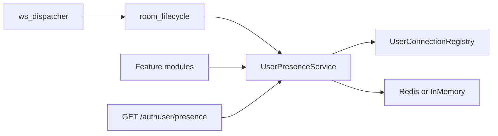

# arcori — User presence system

Technical guide for **online session tracking** on FastAPI authuser WebSocket connections.

**Chart + plain English guide:** [presence-system-flow — diagram](../02_FlowCharts/charts/base/presence-system-flow.html) · [guide](../02_FlowCharts/charts/base/presence-system-flow.guide.html)

Related: [WS_SYSTEM.md](WS_SYSTEM.md), [NOTIFICATION_SYSTEM.md](NOTIFICATION_SYSTEM.md), [PYTHON_STATE_SYSTEM.md](PYTHON_STATE_SYSTEM.md)

---

## Overview

Presence answers: **does this user have an active app WebSocket session?**

| Question | v1 answer |
|----------|-----------|
| Is user online on app WS? | `user_presence_reader.is_online(user_id)` or `GET /authuser/presence` |
| Which worker holds the socket? | `sessions_for_user` → `worker_id` in session metadata |
| Can I push WS frames cross-worker? | Not yet — local send only; see [Limits](#limits-v1) |

Scope: **FastAPI `/ws/authuser` only** (Flutter `kAppApiWsConnectionId`). Dart game WS is out of scope.

---

## Architecture



### Two-layer model

| Layer | Class | Mapping | Storage | Scope |
|-------|-------|---------|---------|-------|
| **Transport** | `UserConnectionRegistry` | `user_id` ↔ `connection_id` | In-memory dict + set | **This worker only** — WS send callbacks |
| **Presence** | `InMemoryPresenceStore` or `RedisPresenceStore` | `user_id` → `UserSession` list | Process RAM or Redis SET + HASH | **Cross-worker** online query |

Both layers are updated together on authuser WS connect/disconnect via `UserPresenceService`. Only the **presence** layer answers “is user B online on any worker?”.

```
Transport (local)                    Presence (shared)
─────────────────                    ─────────────────
_user_to_connections[user_id]      user:{user_id} SET → session ids
  → set(connection_id)               session:{session_id} HASH → metadata + TTL
_connection_to_user[connection_id]
  → user_id
```

Redis keys (when `ARCORI_PRESENCE_ENABLED=true`):

- `Arcori:presence:user:{user_id}` — SET of session ids
- `Arcori:presence:session:{session_id}` — HASH (`user_id`, `worker_id`, `tier`, `connected_at`, `last_seen_at`) + TTL

When Redis is disabled, `InMemoryPresenceStore` holds the same logical mapping in `_user_to_sessions` / `_sessions`. `RedisPresenceStore` falls back to that in-memory store on Redis errors.

---

## Module contract

### Which API to use

| Need | Use | Do not use |
|------|-----|------------|
| Is user online? / session count / worker id | `UserPresenceReader` | `UserConnectionRegistry` |
| Batch online query from HTTP handler | `GET /authuser/presence` | Raw Redis |
| Push WS frame to user | Core delivery (`InboxBroadcaster`, notifications) | Connection ids from transport registry |
| Resolve connection → user on this worker | Core WS code only | Feature modules |

### `UserPresenceReader` (feature modules)

Protocol: [`user_presence_contract.py`](../../app_codebase/python_base_05/bin/core/presence/contracts/user_presence_contract.py)

```python
from core.presence import UserPresenceReader, UserSession, user_presence_reader

if user_presence_reader.is_online(target_user_id):
    sessions: list[UserSession] = user_presence_reader.sessions_for_user(target_user_id)
    count = user_presence_reader.session_count(target_user_id)
```

Equivalent singleton import (core code and tests):

```python
from core.state.state_registry import user_presence  # implements UserPresenceReader
```

Type-check handlers by annotating with `UserPresenceReader` and pass `user_presence_reader` in production or a fake in tests.

**Do not** import `redis`, `RedisPresenceStore`, or `InMemoryPresenceStore` at module call sites.

### `UserConnectionReader` (core / transport only)

Protocol: [`user_connection_reader_contract.py`](../../app_codebase/python_base_05/bin/core/state/contracts/user_connection_reader_contract.py)

Runtime: `state_registry.user_connection_registry` — local `connection_ids_for_user` / `user_id_for_connection`.

Feature modules must not use this for online checks; it misses sockets on other Gunicorn workers.

### `UserSession` fields

| Field | Meaning |
|-------|---------|
| `session_id` | WS connection id (same as transport `connection_id`) |
| `user_id` | Authenticated user UUID |
| `worker_id` | Worker that holds the socket (`hostname:pid` or `ARCORI_WORKER_ID`) |
| `tier` | v1: always `"authuser"` |
| `connected_at` | ISO-8601 UTC when session registered |
| `last_seen_at` | ISO-8601 UTC; refreshed on each inbound WS frame |

---

## Core layout

```
bin/core/presence/
├── __init__.py                     # user_presence_reader singleton (lazy, like read_cache)
├── contracts/
│   ├── user_presence_contract.py   # UserPresenceReader — modules import this shape
│   └── presence_store_contract.py  # internal store API (core only)
├── presence_config.py              # env flags + TTL + worker id
├── presence_types.py               # UserSession dataclass
├── in_memory_presence_store.py     # dev-off store + Redis fail-open fallback
├── redis_presence_store.py         # production / multi-worker
├── user_presence_service.py        # facade: syncs transport + presence store
└── presence_factory.py             # build store from env

bin/core/state/
├── user_connection_registry.py     # local user_id ↔ connection_id (transport)
├── contracts/user_connection_reader_contract.py  # transport read API (core only)
├── state_registry.py               # user_presence + user_connection_registry singletons
└── room/room_lifecycle.py          # on_ws_authuser_connected / closed / message
```

---

## Lifecycle

| Event | Hook | Action |
|-------|------|--------|
| Authuser WS auth OK | `on_ws_authuser_connected` | Local register + Redis session |
| Each inbound frame | `on_ws_authuser_message` | Refresh TTL + `last_seen_at` |
| Disconnect | `on_ws_connection_closed` | Local + Redis unregister |

Wired from [`ws_dispatcher.py`](../../app_codebase/python_base_05/bin/core/ws/ws_dispatcher.py).

---

## HTTP API

```
GET /authuser/presence?user_ids=uuid1,uuid2
```

Response:

```json
{
  "ok": true,
  "data": {
    "users": {
      "uuid1": { "online": true, "session_count": 1 },
      "uuid2": { "online": false, "session_count": 0 }
    }
  }
}
```

- Auth required; max 50 ids per request
- Module: [`modules/presence/`](../../app_codebase/python_base_05/bin/modules/presence/)

---

## Environment

| Variable | Default | Purpose |
|----------|---------|---------|
| `ARCORI_PRESENCE_ENABLED` | `false` | `true` → Redis store; `false` → in-memory only |
| `ARCORI_PRESENCE_SESSION_TTL_SECONDS` | `90` | Session key TTL; refreshed on WS activity |
| `ARCORI_PRESENCE_KEY_PREFIX` | `Arcori:presence:` | Redis key prefix |
| `ARCORI_WORKER_ID` | `{hostname}:{pid}` | Optional stable worker id |
| `REDIS_HOST` / `REDIS_PORT` | `127.0.0.1` / `6379` | Shared with read-cache client |

Docker debug compose adds `Arcori_redis` and sets API `REDIS_HOST=Arcori_redis`.

---

## Example: game invite (vertical module)

```python
from core.presence import user_presence_reader
from modules.notifications.notification_service import create_for_user
from models.user_notification import NOTIFICATION_TYPE_INSTANT

def invite_user(*, inviter_id: str, target_user_id: str) -> str:
    # Authorization rules live in the game module
    return create_for_user(
        target_user_id,
        source="my_game",
        notification_type=NOTIFICATION_TYPE_INSTANT,
        title="Game invite",
        body="Player invited you",
        msg_id="my_game_invite_v1",
        data={
            "from_user_id": inviter_id,
            "response": {
                "type": "reply",
                "options": [
                    {"key": "accept", "label": "Accept"},
                    {"key": "decline", "label": "Decline"},
                ],
            },
        },
    )

if user_presence_reader.is_online(target_user_id):
    ...
```

Notification row persists whether or not the user is online; presence is for analytics or UI hints only.

---

## Limits (v1)

- **No Dart game WS presence**
- **No Postgres session table**
- **InboxBroadcaster** still local-only — online query works cross-worker; WS nudge may miss if user is on another worker
- **Follow-up:** Redis pub/sub for cross-worker WS delivery

---

## Tests

| Area | Path |
|------|------|
| In-memory store | `tests/core/presence/test_in_memory_presence.py` |
| Redis (skip if unavailable) | `tests/core/presence/test_redis_presence.py` |
| WS lifecycle hooks | `tests/core/presence/test_presence_ws_lifecycle.py` |
| HTTP parse/query | `tests/modules/presence/test_presence_service.py` |

```bash
cd app_codebase/python_base_05
PYTHONPATH=bin python3 -m pytest tests/core/presence/ tests/modules/presence/ -q
```
